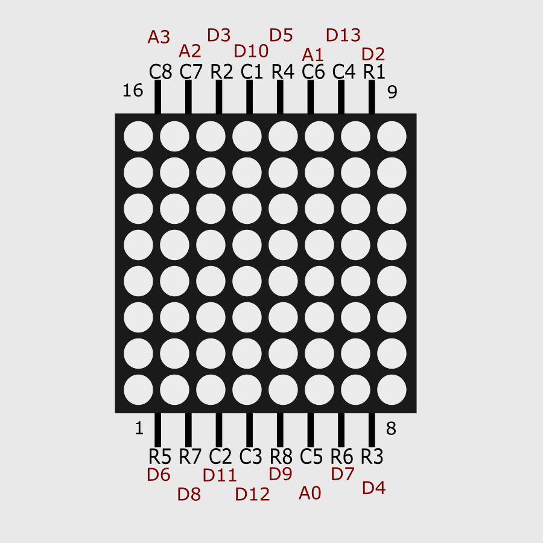

# Arduino-LED-Matrix-Goz-Animasyonu
8x8 LED matris (1088BS) üzerinde özgün göz kırpma animasyonu + otomatik reset özelliği (Türkçe dokümantasyon)

## 🔍 Proje Özellikleri
- **Göz Animasyonları**: Tam açık, yarı açık, kapalı (8x8 özel desenler).  
- **Akıllı Zamanlama**: Rastgele aralıklarla gerçekçi kırpma.  
- **Otomatik Reset**: 30 dakikada bir yazılımsal reset.  
- **Türkçe Açıklamalar**: Tüm kod blokları detaylı yorumlandı.  

## 🛠 Donanım Bağlantıları
| Pin Türü | Arduino Bağlantıları |  
|----------|----------------------|  
| Satırlar | D2-D9                |  
| Sütunlar | D10-D13, A0-A3       |  

## 💡 Bu Proje Neden Özgün?
- Orijinal göz desenleri ve animasyon geçişleri.  
- Dinamik zamanlama sistemi (standart kütüphanelerde yok).  
- Türkçe yorumlarla yerel topluma katkı.

Bu proje, LED matris kontrolü için temel yöntemlerden esinlenilerek geliştirilmiştir. 
Animasyonlar ve sistem özellikleri tamamen özgündür.

## 📜 Lisans
Bu proje [MIT Lisansı](LICENSE) altında yayınlanmıştır. Açık kaynak kullanımı teşvik etmek için oluşturulmuştur.

**Temel Haklar:**
- Kodu ücretsiz kullanabilir, değiştirebilir ve dağıtabilirsiniz
- Ticari projelerde kullanılabilir
- Yalnızca orijinal lisans metnini ve telif hakkı bildirimini korumalısınız

Detaylı lisans koşulları için: [LICENSE dosyasını inceleyin](LICENSE)

